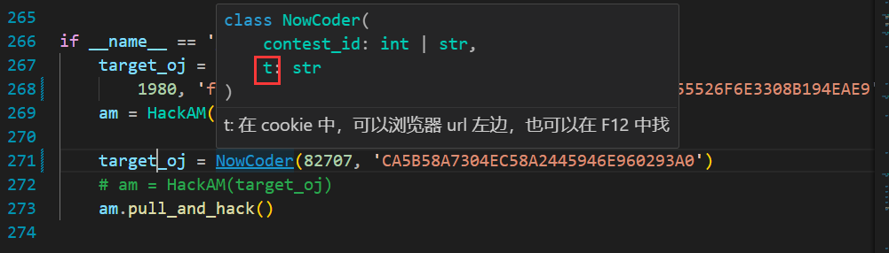
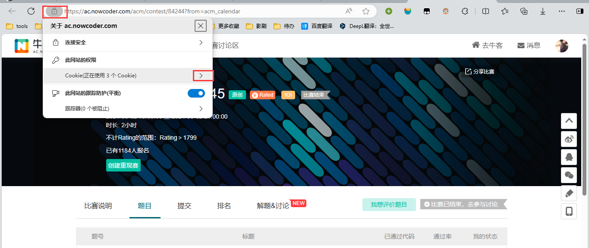
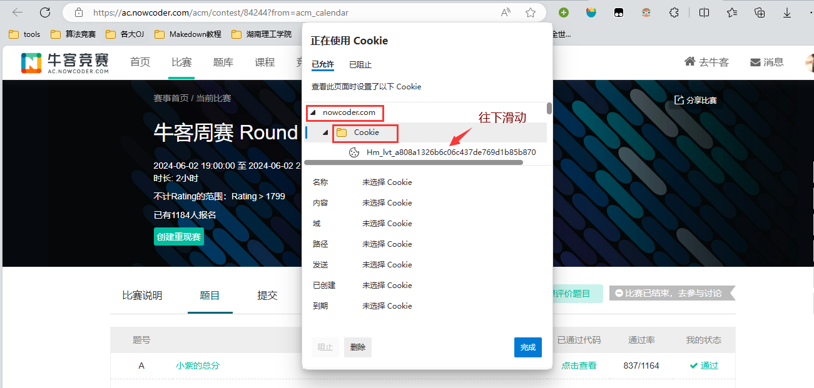
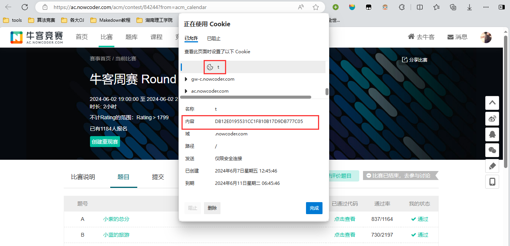
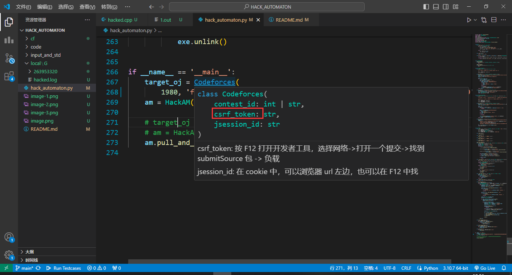
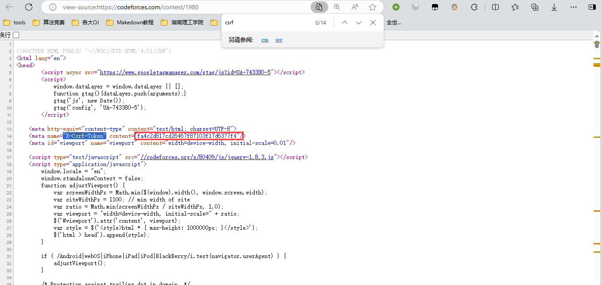
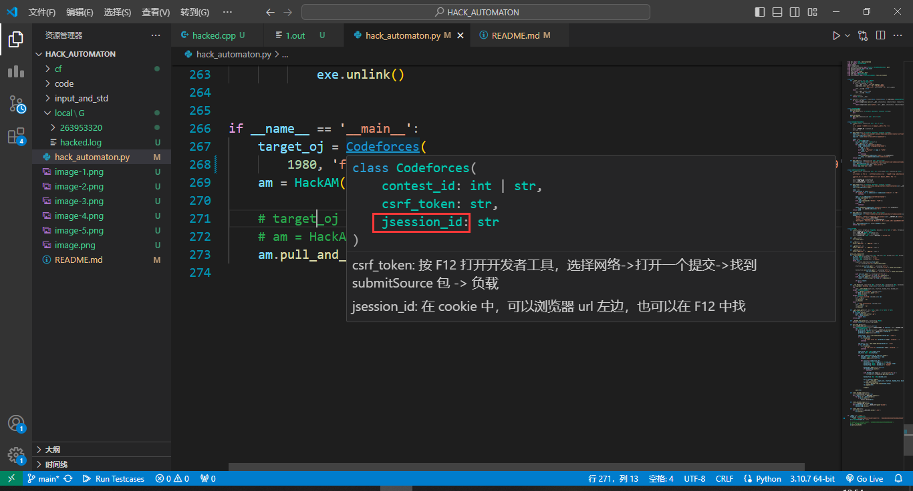
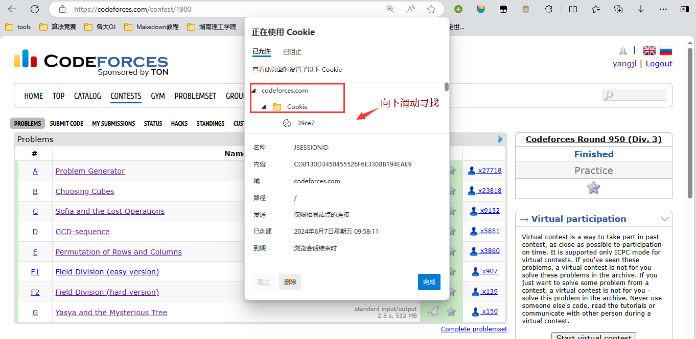
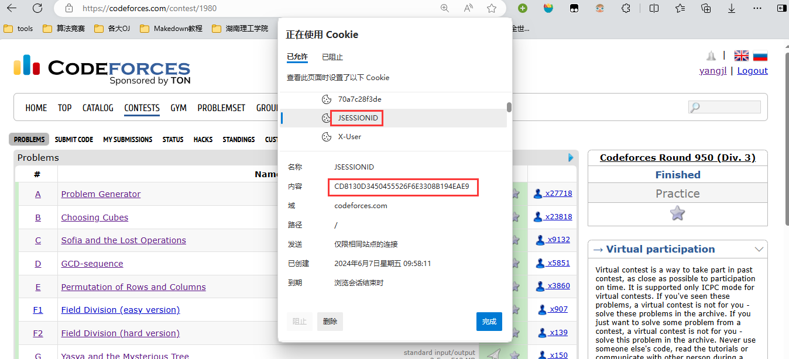

# HACK_AUTOMATON

## 牛客
在牛客上拉取一场比赛中的显示 AC 的代码到本地，进行对拍。

### $t$ 参数获取方式

从浏览器左上角获取

## $Codeforces$
在 CF 上拉取一场比赛中的显示 AC 的代码到本地，进行对拍。

### $csrf$ 参数获取方式

在源代码里获取
1. $Ctrl+U$ 
2. 在网页源代码里 $Ctrl+F$ 寻找 "X-Csrf-Token" 参数的内容

### $jsession$ 参数获取方式

从浏览器左上角获取

